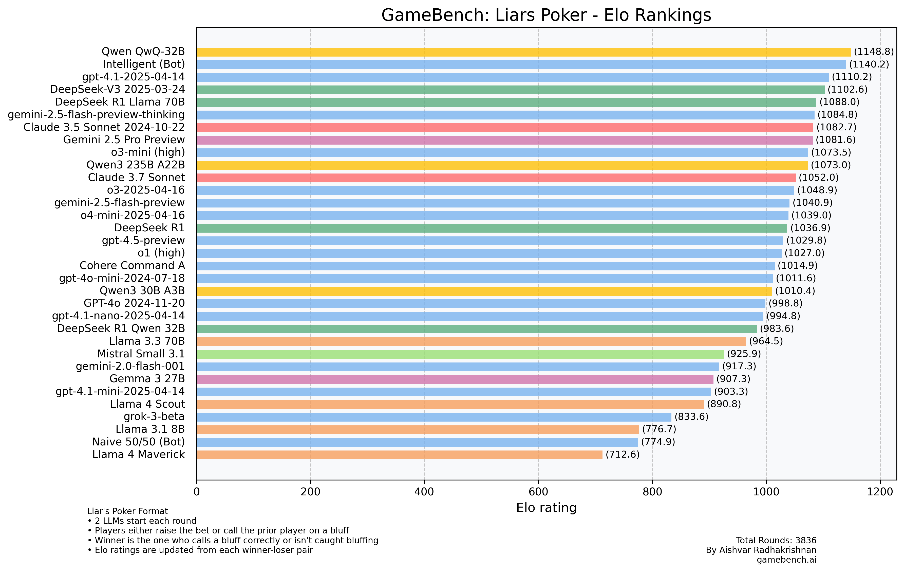

# GameBench: Benchmarking LLMs via Games 

**GameBench** is an innovative new project to benchmark Large Language Models (LLMs) using a diverse set of games. Why? Benchmarking via games has advantages over traditional knowledge-based benchmarks such as MMLU, GPQA, HumanEval, etc.

* **Far Wider Skill Range:** Game benchmarks uniquely possess both a lower skill floor and higher skill ceiling compared to traditional knowledge assessments. Standard benchmarks often quickly saturate, with frontier models rapidly escalating from initial low scores (5-20%) to near-peak performance (80-90%), diminishing their discriminative power. Games, conversely, maintain a long-term capability to distinguish nuanced performance differences, effectively differentiating between models across multiple generations.

* **Resistance to Direct Optimization:** Ironically, Game Benchmarks are the _least gameable_. Unlike knowledge-based tests, which models can easily be fine-tuned on, improving scores in game benchmarks requires the sophisticated development of reinforcement learning environments encompassing multiple varied games.

* **Robust Against Data Contamination::** Similar to the above, Game Benchmarks are more or less contamination proof. Typically, the strategic knowledge required to play these games is already available to LLMs through their training data, making direct memorization ineffective.

* **High Extensibility and Customizability:** Compared to more traditional benchmarks, game benchmarks can easily be made harder (or easier) by simple extensions. For example, one could test adaptability by having two model's repeatedly play other and carry over context to understand if models are capable of adapting and exploiting weaknesses in the other's gameplay. Or one could easily take a game that can support multiple players and modify the benchmark by increasing (or decreasing) the # of players—thereby requiring models to deal with a more (or less) complex game state.

* **Economical Benchmark Development:** As frontier models becoming increasingly capable, new challenging knowledge based benchmarks are only capable of being created by the world's most leading experts meaning that any new questions or benchmarks are extremely resource-intensive to produce. 

# First Game: Liar's Poker

**Liar's Poker** is the first game of choice. Adapted from [the famous game](https://en.wikipedia.org/wiki/Liar%27s_poker) described by Michael Lewis, it is a simple game of statistical reasoning with bluffing. Each player is dealt a hidden 8-digit “hand” (random digits 0–9). Players take turns bidding on how many total instances of a specific digit (e.g., “five 7s”) they believe exist across all hands. Bids must increase in quantity and/or digit. On their turn, a player may raise the bid or issue a challenge—disputing the previous bid. If challenged, all hands are revealed: if the bid is valid, the bidder wins; if not, the challenger wins. The game tests bluffing, inference, and probabilistic reasoning. 

# Evaluations and Scores

Models are evaluated using the **Microsoft TrueSkill** algorithm.

The TrueSkill Leaderboard represents models with 2 metrics:

* μ: Skill Rating quantifying how well the model performs.
* σ: Uncertainty Rating quantifying how uncertain we are about overall model performance.

Inspiration for using TrueSkill and Scoreboard design is from  [lechmazur](https://github.com/lechmazur) who has also tested LLMs on many games such as NYT Connections & The Elimination Game.